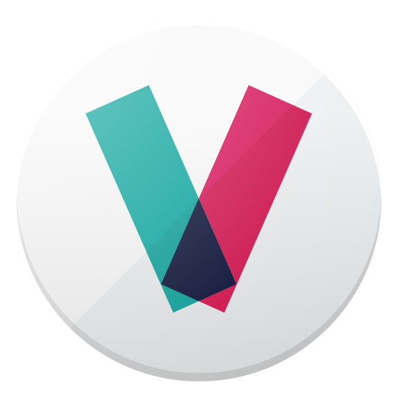

The following is a list of some of the public apps using Leku and are published on the Google Play Store.

Want to add your app? Found an app that no longer works or no longer uses Leku? Please submit a pull request on GitHub to update this page!

|  |  | 
|---|---|---
| [vibbo](https://play.google.com/store/apps/details?id=com.anuntis.segundamano) | [Worksi](https://play.google.com/store/apps/details?id=com.scmspain.worksi) | [Domoticz](https://play.google.com/store/apps/details?id=nl.hnogames.domoticz)
